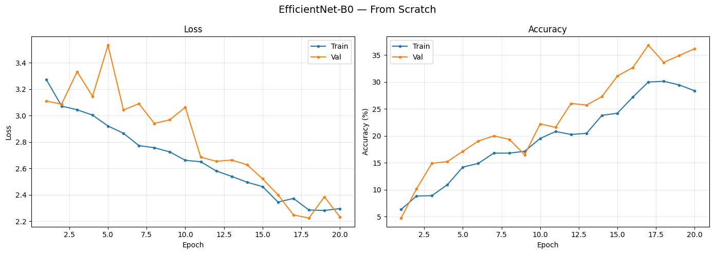
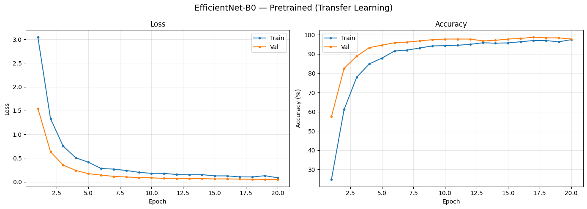
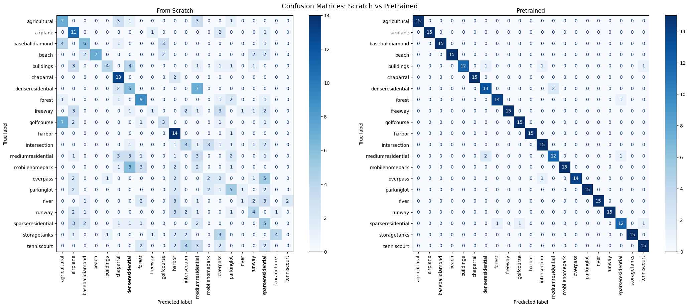

# HW 1 — EfficientNet-B0 on UC Merced Land Use: Scratch vs Transfer Learning

**Dataset:** UC Merced Land Use (21 classes, ~100 images/class) | **Model:** EfficientNet-B0 | **Epochs:** 20

---

## Setup & Model Definition

```python
NUM_CLASSES = 21
EPOCHS      = 20
BATCH_SIZE  = 64
LR          = 1e-4

# Scratch — random weights
model_scratch    = timm.create_model('efficientnet_b0', pretrained=False, num_classes=NUM_CLASSES)

# Pretrained — ImageNet weights, fine-tuned
model_pretrained = timm.create_model('efficientnet_b0', pretrained=True,  num_classes=NUM_CLASSES)
```

Transforms were resolved directly from each model's `timm` config (resize, normalize) with random augmentation enabled for training.


---

## Training Curves

| From Scratch | Pretrained (Transfer Learning) |
|:---:|:---:|
|  |  |

The scratch model's loss decreases slowly and validation accuracy plateaus around 30–35%. The pretrained model converges within the first 3–4 epochs and stabilises above 95%.

---

## Confusion Matrices



The scratch matrix is broadly scattered with no clear diagonal. The pretrained matrix is nearly diagonal.

---

## Results

| Model | Test Accuracy | Balanced Accuracy |
|---|---|---|
| From Scratch | 34.60% | 34.60% |
| Pretrained | **95.87%** | **95.87%** |

---

## Discussion

**Accuracy & Convergence:**
The pretrained model reaches 95.87% test accuracy compared to only 34.60% for the scratch model. This makes sense because transfer learning from ImageNet gives the model a head start - it already knows how to detect edges, textures, and shapes, so it converges quickly and to a much better solution. The scratch model struggles because the dataset is small (~70 images per class for training), and learning useful features from scratch with that little data is really difficult for a deep network like EfficientNet-B0.

**Hardest Classes:**
Looking at the classification reports, the hardest classes for the scratch model are `mobilehomepark` and `tenniscourt`, both with F1 = 0.00 - the model never correctly predicts either class. `freeway`, `river`, and `overpass` are also very low (all around 0.11–0.12). The three residential density classes - `mediumresidential` (0.15), `sparseresidential` (0.23), and `denseresidential` (0.32) - are also poorly classified, which makes sense since they look very similar from above and only differ in how dense the buildings are.

For the pretrained model, almost everything works well, but the residential classes are still the weakest: `buildings` (F1 0.89), `denseresidential` (0.84), `mediumresidential` (0.83), and `sparseresidential` (0.83). These are the only classes where the pretrained model makes noticeable mistakes, likely because distinguishing residential density from a satellite image is genuinely ambiguous even for a strong model.

**Pretrained vs Scratch:**
Transfer learning makes a huge difference here. The biggest improvements are on classes the scratch model completely fails on: `mobilehomepark` goes from 0.00 to 1.00, `tenniscourt` from 0.00 to 0.94, `freeway` and `river` both go from 0.11 to 1.00, and `storagetanks` from 0.40 to 1.00. These classes have pretty distinct visual patterns - tennis court lines, cylindrical tanks, straight roads — that ImageNet pretraining helps the model recognize. The scratch model just doesn't get enough examples to learn those patterns on its own. The one area where pretraining doesn't fully solve the problem is the residential cluster (`buildings`, `dense/medium/sparseresidential`), which stays somewhat hard because the differences between those classes are subtle and there's nothing quite like "overhead building density" in ImageNet.
