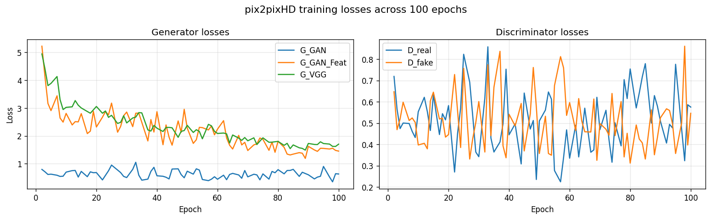
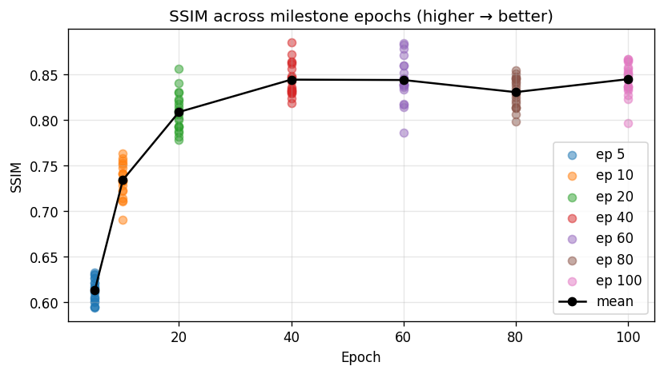
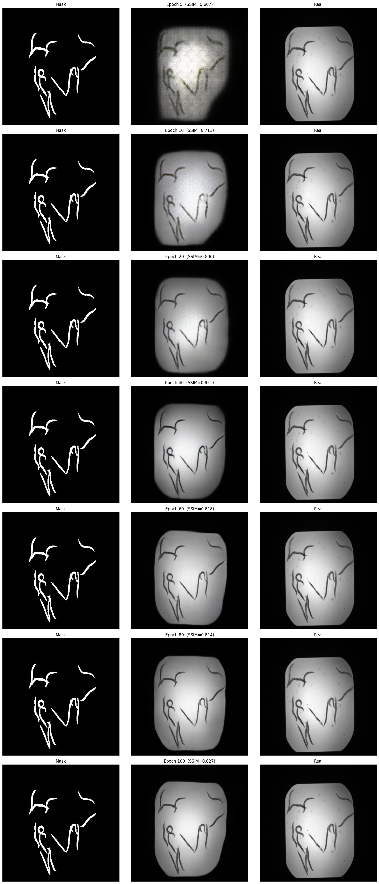

# HW 3 Report - pix2pixHD on BBBC010
Ranzmaier Andreas 

## Dataset & Pre-processing

**BBBC010** is a publicly available *C. elegans* brightfield microscopy dataset from the
Broad Bioimage Benchmark Collection. It contains 100 wells, each imaged in two channels
(w1: fluorescence, w2: brightfield) at 16-bit depth, together with per-well binary
foreground masks labelling worm pixels.

**Pre-processing pipeline (00_PrepData.ipynb):**

1. Downloaded three archives from Broad Institute: images, per-well foreground masks, and
   per-worm foreground masks (the latter not used in training).
2. Paired each well's **channel-2 (brightfield) image** with its corresponding binary mask
   by extracting the well code (e.g. `A02`) from both filenames.
3. **Binarisation**: mask pixels > 0 set to 255; all else to 0.
4. **Normalisation**: 16-bit images linearly mapped to [0, 255] using per-image min/max, then
   converted to 8-bit RGB.
5. **Resize**: both mask and image resized to 512 × 512 (bilinear for images, nearest-neighbour
   for masks to preserve sharp boundaries).
6. **Split**: 80 train / 20 test wells, drawn with `random.seed(42)`.
7. Saved in pix2pixHD layout: `train_A` / `train_B` / `test_A` / `test_B` (A = mask, B = image).

---

## Training

**Environment.** Training ran inside a Dev Container (WSL2, Linux) on an NVIDIA RTX 5070 GPU.
All tensors were placed on the GPU via `--gpu_ids 0` and `cudnn.benchmark = True` was active.
Training ran in full FP32; the existing `--fp16` flag relies on NVIDIA Apex (not installed) and
was not used. Native `torch.amp` mixed precision or BF16 would further exploit the 5070's
tensor cores but was not pursued given the already fast ~11 s/epoch.

pix2pixHD was cloned from NVIDIA's repository and patched for Python 3.11+ compatibility
(`apply_patches.py`). Key training flags:

| Flag | Value | Reason |
|---|---|---|
| `--label_nc` | 0 | Input is a raw image (mask), not a semantic map |
| `--no_instance` | - | No instance boundaries |
| `--loadSize / --fineSize` | 512 | Matches pre-processing |
| `--batchSize` | 2 | Fits a single modern GPU at 512 × 512 |
| `--niter` | 100 | Training epochs (extended from 40 after observing continued loss improvement) |
| `--niter_decay` | 0 | Constant LR throughout |
| `--save_epoch_freq` | 100 | Disabled periodic saves; milestone logic handles checkpoints |

I applied two additional patches to `custom_dataset_data_loader.py` for the WSL2/container
environment i am running locally: `num_workers=0` (avoids forking into worker processes, which fail when `/dev/shm`
is too small) and `pin_memory=False` (skips pinned CPU memory). These are purely infrastructure settings - they have no effect on
gradients, model weights, or evaluation metrics. Because BBBC010 is small (80 training images),
training is compute-bound; the ~11 s/epoch observed is dominated by forward/backward passes,
not data loading.

Milestone checkpoints were saved at epochs **5, 10, 20, 40, 60, 80, 100** via the patched
`train.py`. Training was extended beyond the original 40 epochs after inspecting losses at
epoch 60, which showed meaningful improvement over epoch 40:

| Loss term   | Epoch 40 | Epoch 60 | Δ     |
|------------|----------|----------|-------|
| G_GAN      |  0.569   |  0.444   | −22 % |
| G_GAN_Feat |  2.868   |  2.241   | −22 % |
| G_VGG      |  2.277   |  2.087   |  −8 % |
| D_real     |  0.445   |  0.335   | −25 % |

### Training loss curves

Generator losses (G_GAN, G_GAN_Feat, G_VGG) show a clear downward trend across all 100
epochs. Discriminator losses (D_real, D_fake) oscillate heavily throughout, which is
expected in adversarial training. The generator and discriminator minimaxing each other,
so each gain is immediately countered by the other, producing noisy curves
without a clean trend.

---

## SSIM Results

SSIM (Structural Similarity Index) was computed between each generated test image and its
ground-truth brightfield counterpart, using the luminance channel (mean of RGB) with
`data_range=255`.

| Epoch | Mean SSIM | Std   |
|------:|----------:|------:|
|     5 |   0.613   | 0.012 |
|    10 |   0.734   | 0.018 |
|    20 |   0.809   | 0.020 |
|    40 |   0.844   | 0.017 |
|    60 |   0.844   | 0.024 |
|    80 |   0.831   | 0.016 |
|   100 |   0.845   | 0.017 |

SSIM improves most steeply between epochs 5 and 20 (+0.196), as the generator learns coarse
worm shape and brightness distribution. From epoch 40 onward SSIM plateaus near **0.844**,
with epochs 60–100 varying by only ±0.014.

Notably, training losses continued to improve through epoch 60 even as SSIM flattened
(G_GAN and G_GAN_Feat each dropped ~22 %). This reflects a known limitation of SSIM: it
rewards pixel-aligned structure but is insensitive to high-frequency texture quality that
improves later in GAN training. 

The best cost/quality trade-off sits at around **epoch 60**, where perceptual losses have improved
substantially and diminishing returns set in thereafter.

---

## Visual Quality & Artefacts

**Plausibility.** By epoch 20–40 generated images show the characteristic granular
brightfield texture of *C. elegans* within the mask boundary. The background (outside the
mask) is correctly rendered as a flat, near-uniform grey consistent with the real images.
Early epochs also overshoot brightness at the middle part, but this is largely resolved by epoch 40.

**Background cleanliness.** Real brightfield images contain small random background spots of
dust, out-of-focus debris, and sensor noise which the generator largely fails to reproduce. The
generated backgrounds are uniformly clean. This is expected: the model learns the average
background appearance from 80 training images, suppressing low-frequency noise it cannot
predict per-image.

**Internal worm structure beyond epoch 60.** After epoch 60 the internal texture of the
worm bodies becomes slightly more defined with faint internal granularity and brightness
gradients start to emerge that are absent in earlier checkpoints. This aligns with the
observed continued drop in G_GAN_Feat and G_VGG losses beyond epoch 40: the generator is
still refining high-frequency detail even after SSIM has plateaued.

**Zoomed comparison.** Zooming into worm bodies reveals that the real images have
anisotropic internal structure (gut granules, refraction rings) that the model approximates
only statistically - generated granularity is plausible but not pixel-accurate, as expected
for a stochastic GAN. For this i also updated the 02_Evaluation notebook to show the full size512 × 512 images, which better reveals the internal texture quality and background noise.

---

## Summary

pix2pixHD trained for 100 epochs on 80 mask–image pairs generates qualitatively convincing
*C. elegans* brightfield images. SSIM improves steeply through epoch 20 then plateaus near
0.844 from epoch 40 onward; the best cost/quality trade-off is at around **epoch 60**, where training losses had improved ~22 % over epoch 40 while SSIM remained stable.